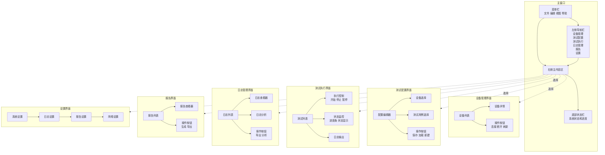

# GUI模块详细设计

## 1. 模块概述

GUI模块负责为用户提供可视化的操作界面，通过调用CLI命令实现蓝牙自动化测试平台的功能。

## 2. 功能需求

- 设备管理：显示和管理手机设备和串口设备
- 测试配置：创建和编辑测试配置文件
- 测试执行：启动、停止和监控测试执行
- 日志管理：查看和分析测试日志
- 报告生成：生成和查看测试报告
- 系统设置：配置系统参数和环境

## 3. 设计方案

- 使用PySide6框架构建GUI界面
- 采用MVC架构模式
- 通过调用CLI命令实现功能
- 支持多线程操作，避免界面卡顿
- 提供响应式设计，适配不同屏幕尺寸

## 4. 接口设计

```python
# 核心类
class MainWindow(QMainWindow):
    def __init__(self):
        super().__init__()
        self.setup_ui()
    
    def setup_ui(self):
        # 设置UI界面
        pass

class DeviceManagerWidget(QWidget):
    def __init__(self):
        super().__init__()
        self.setup_ui()
    
    def refresh_devices(self):
        # 刷新设备列表
        pass
    
    def connect_device(self, device_id):
        # 连接设备
        pass
    
    def disconnect_device(self, device_id):
        # 断开设备连接
        pass

class TestConfigWidget(QWidget):
    def __init__(self):
        super().__init__()
        self.setup_ui()
    
    def create_config(self):
        # 创建新配置
        pass
    
    def load_config(self, file_path):
        # 加载配置文件
        pass
    
    def save_config(self, file_path):
        # 保存配置文件
        pass

class TestExecutionWidget(QWidget):
    def __init__(self):
        super().__init__()
        self.setup_ui()
    
    def start_test(self, config_file, prep_script=None):
        # 启动测试
        pass
    
    def stop_test(self, session_id):
        # 停止测试
        pass
    
    def refresh_status(self):
        # 刷新测试状态
        pass

class LogManagerWidget(QWidget):
    def __init__(self):
        super().__init__()
        self.setup_ui()
    
    def start_logging(self, device_id):
        # 开始日志收集
        pass
    
    def stop_logging(self):
        # 停止日志收集
        pass
    
    def view_log(self, log_file):
        # 查看日志内容
        pass
    
    def analyze_log(self, log_file):
        # 分析日志
        pass

class ReportWidget(QWidget):
    def __init__(self):
        super().__init__()
        self.setup_ui()
    
    def generate_report(self, session_id, format):
        # 生成报告
        pass
    
    def view_report(self, report_file):
        # 查看报告
        pass

class SettingsWidget(QWidget):
    def __init__(self):
        super().__init__()
        self.setup_ui()
    
    def load_settings(self):
        # 加载设置
        pass
    
    def save_settings(self):
        # 保存设置
        pass

class CLICommunicator:
    def __init__(self):
        pass
    
    def execute_command(self, command, args=None):
        # 执行CLI命令
        pass
    
    def execute_async(self, command, args=None, callback=None):
        # 异步执行CLI命令
        pass
```

## 5. 数据结构

```python
# 设备信息
class DeviceInfo:
    device_id: str
    device_type: str  # PHONE, SERIAL
    status: str
    connection_info: dict

# 测试会话信息
class TestSessionInfo:
    session_id: str
    status: str
    start_time: datetime
    end_time: datetime
    test_cases: List[str]
    progress: float

# 测试结果
class TestResultInfo:
    case_id: str
    status: str
    start_time: datetime
    end_time: datetime
    error_message: str

# 日志信息
class LogInfo:
    log_file: str
    log_type: str
    start_time: datetime
    end_time: datetime
    size: int

# 报告信息
class ReportInfo:
    report_file: str
    format: str
    session_id: str
    generated_time: datetime

# 系统设置
class SystemSettings:
    cli_path: str
    adb_path: str
    serial_port: str
    log_dir: str
    report_dir: str
    concurrency: int
```

## 6. 实现细节

- **界面设计**：
  - 使用PySide6的QMainWindow、QWidget等组件构建界面
  - 采用QStackedWidget实现多页面切换
  - 使用QTableView和QTreeView展示设备和测试信息
  - 实现QProgressBar显示测试进度
  - 提供响应式布局，适配不同屏幕尺寸
- **多线程处理**：
  - 使用QThread实现后台任务，避免界面卡顿
  - 实现信号槽机制，处理线程间通信
  - 支持任务的取消和暂停
  - 提供线程状态的监控和管理
- **CLI调用**：
  - 通过subprocess模块调用CLI命令
  - 解析CLI命令的输出，转换为GUI可显示的格式
  - 实现命令的参数传递和结果解析
  - 处理命令执行的超时和错误
- **错误处理**：
  - 实现错误的捕获和处理
  - 提供用户友好的错误提示
  - 支持错误的分类和优先级管理
  - 实现错误的日志记录和报告
- **响应式设计**：
  - 适配不同屏幕尺寸和分辨率
  - 提供可调整的界面布局
  - 支持高DPI显示
  - 实现界面元素的动态调整
- **多语言支持**：
  - 使用Qt的翻译框架（QLocale和QTranslator）
  - 支持中文和英文界面
  - 提供语言切换功能
  - 支持自定义翻译文件
- **用户权限管理**：
  - 基于角色的权限控制
  - 支持不同用户角色（管理员、测试人员、查看者）
  - 提供权限配置界面
  - 实现用户登录和认证
- **主题切换**：
  - 支持不同的视觉风格（亮色、暗色等）
  - 提供主题配置界面
  - 支持自定义主题
  - 支持系统主题同步
- **测试执行编排**：
  - 支持拖拽式测试流程设计
  - 提供测试步骤的可视化编辑
  - 支持测试流程的保存和加载
  - 实现测试流程的验证和优化
- **系统监控**：
  - 增加系统状态的实时监控面板
  - 显示关键指标，如设备状态、测试进度等
  - 提供系统资源使用情况的监控
  - 实现异常状态的实时告警
- **多窗口支持**：
  - 支持多窗口同时操作
  - 提供窗口布局的保存和恢复
  - 支持多显示器配置
  - 实现窗口间的通信和数据共享
- **测试结果对比**：
  - 支持不同测试结果的对比分析
  - 提供对比报告和可视化
  - 支持历史数据的趋势分析
  - 实现测试质量的评估和报告
- **系统集成**：
  - 支持与JIRA、Jenkins等系统的集成
  - 提供API接口，便于与其他系统集成
  - 支持数据的导入和导出
  - 实现集成的认证和授权
- **自动化任务**：
  - 支持定时执行测试任务
  - 提供任务调度和管理
  - 支持任务执行结果的通知
  - 实现任务的依赖管理和优先级调度
- **可定制化界面**：
  - 支持界面布局的自定义
  - 提供主题和样式的定制
  - 支持插件化界面扩展
  - 实现用户配置的保存和加载
- **测试报告**：
  - 支持自动生成测试报告
  - 提供报告模板的定制
  - 支持报告的导出和分享
  - 实现报告的预览和打印
- **用户管理**：
  - 支持用户的创建和管理
  - 提供用户权限的配置
  - 支持用户操作的审计日志
  - 实现用户偏好的保存和恢复
- **与其他模块的集成**：
  - 与测试执行模块集成，控制测试执行和获取状态
  - 与日志收集模块集成，查看和分析测试日志
  - 与串口控制模块集成，管理串口设备和发送指令
  - 与ADB控制模块集成，管理手机设备
  - 与核心引擎集成，获取系统状态和管理接口

## 7. 界面设计

### 7.1 主界面布局图



### 7.2 主界面
- 顶部菜单栏：文件、编辑、视图、帮助
- 左侧导航栏：设备管理、测试配置、测试执行、日志管理、报告、设置
- 右侧主内容区：根据导航选择显示对应功能
- 底部状态栏：显示系统状态和进度

### 7.3 设备管理界面
- 设备列表：显示所有已连接和可连接的设备
- 设备详情：显示选中设备的详细信息
- 操作按钮：连接、断开、刷新

### 7.4 测试配置界面
- 配置编辑器：可视化编辑测试配置
- 设备选择：选择测试使用的设备
- 测试用例选择：选择要执行的测试用例
- 保存/加载按钮：保存和加载配置文件

### 7.5 测试执行界面
- 测试列表：显示测试会话和状态
- 执行控制：开始、停止、暂停测试
- 状态监控：显示测试执行状态和进度
- 日志输出：实时显示测试日志

### 7.6 日志管理界面
- 日志列表：显示所有收集的日志
- 日志查看器：查看日志内容
- 日志分析：分析日志并显示结果
- 导出按钮：导出日志和分析结果

### 7.7 报告界面
- 报告列表：显示所有生成的报告
- 报告查看器：查看报告内容
- 生成按钮：生成新报告
- 导出按钮：导出报告到不同格式

### 7.8 设置界面
- 系统设置：配置CLI路径、ADB路径等
- 日志设置：配置日志存储路径和级别
- 报告设置：配置报告格式和存储路径
- 网络设置：配置网络连接参数

## 8. 测试计划

- 测试界面布局和导航
- 测试设备管理功能
- 测试测试配置功能
- 测试测试执行功能
- 测试日志管理功能
- 测试报告生成功能
- 测试系统设置功能
- 测试错误处理和异常情况

## 9. 部署与集成

### 9.1 依赖管理
- **核心依赖**：
  - PySide6：用于构建GUI界面
  - Click/Typer：用于命令行界面
  - pyyaml：用于配置文件解析
  - loguru：用于日志管理
  - pandas：用于数据处理和分析
  - matplotlib：用于数据可视化
- **可选依赖**：
  - pytest：用于单元测试
  - pyinstaller：用于打包应用
  - cx_Freeze：用于创建可执行文件

### 9.2 安装与配置
- **安装方式**：
  - 通过pip安装：`pip install bt-gui`
  - 从源码安装：`pip install -e .`
  - 通过安装包安装：提供Windows、Linux和macOS平台的安装包
- **配置文件**：
  - 支持JSON、YAML格式的配置文件
  - 默认配置文件路径：`~/.config/bt-gui/config.yaml`
  - 支持通过环境变量覆盖配置

### 9.3 集成接口
- **CLI接口**：通过调用CLI命令实现功能
- **Python API**：提供Python API，便于其他Python应用集成
- **与其他模块的集成**：
  - 与测试执行模块集成，控制测试执行和获取状态
  - 与日志收集模块集成，查看和分析测试日志
  - 与串口控制模块集成，管理串口设备和发送指令
  - 与ADB控制模块集成，管理手机设备

### 9.4 部署场景
- **本地部署**：直接在本地机器上安装和运行
- **容器化部署**：支持Docker容器化部署
- **远程部署**：支持在远程服务器上部署，通过远程桌面或VNC访问

### 9.5 打包与分发
- **Windows**：使用pyinstaller或cx_Freeze创建可执行文件和安装包
- **Linux**：使用pyinstaller创建可执行文件，或通过pip安装
- **macOS**：使用pyinstaller创建应用包（.app）