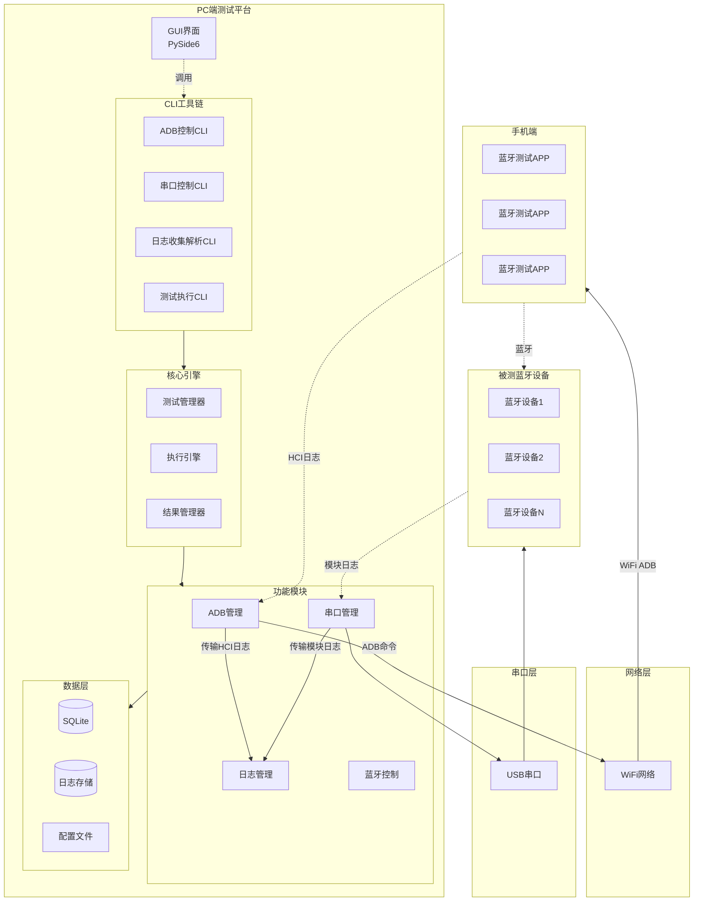
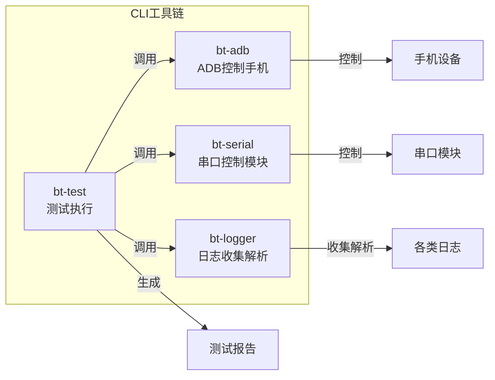
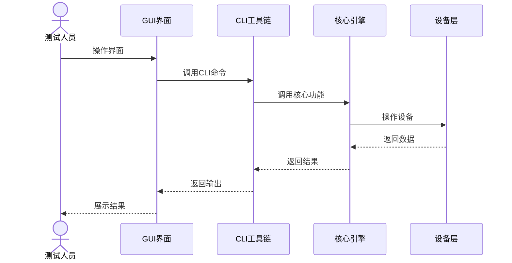
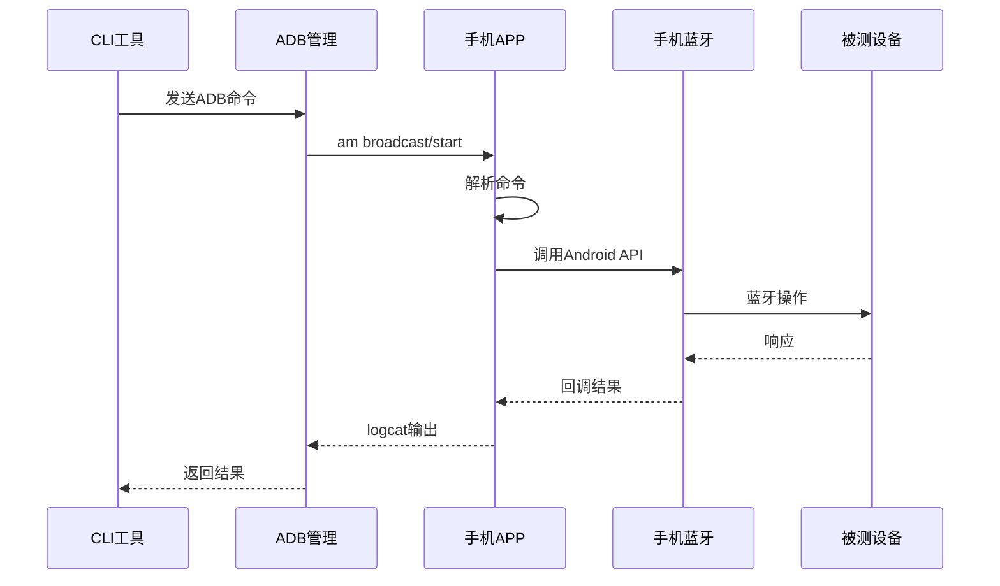
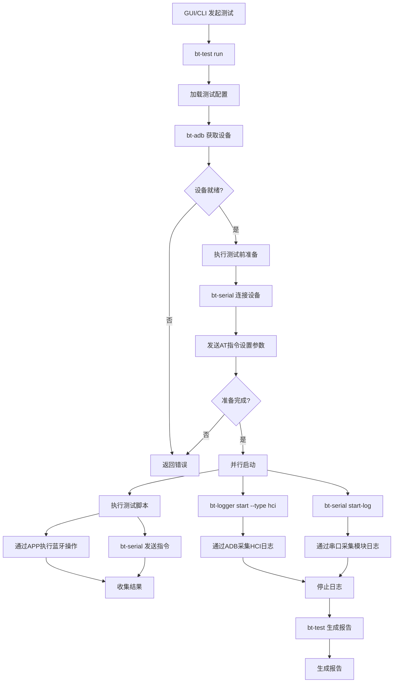
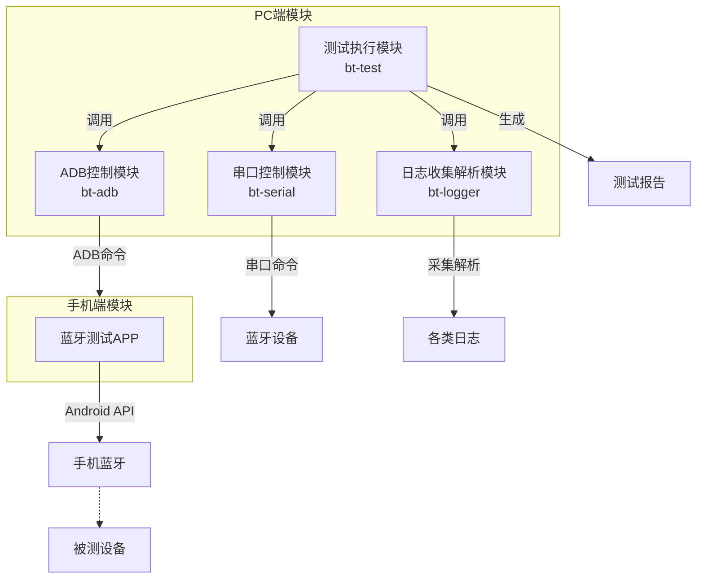
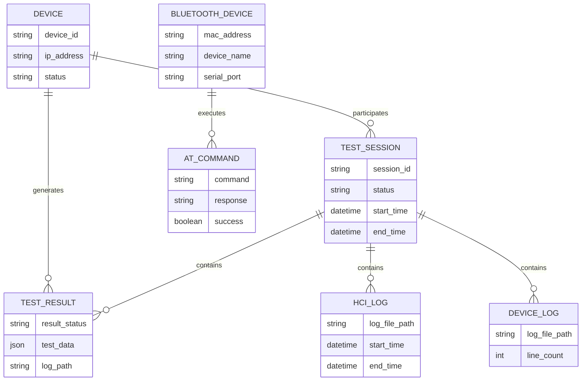
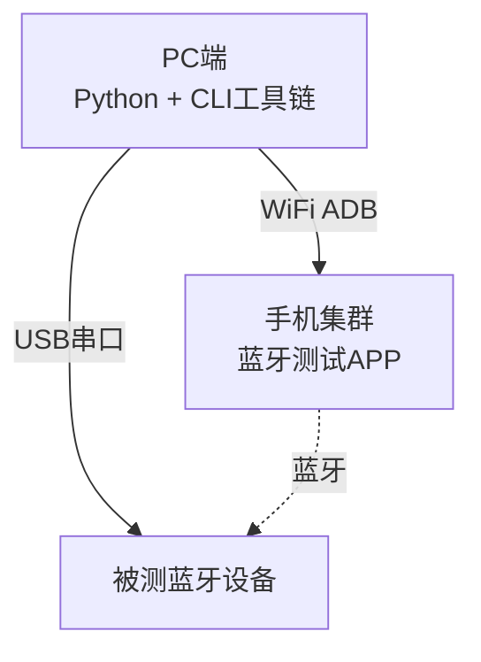

# 蓝牙自动化测试平台概要设计文档

## 1. 项目概述

### 1.1 项目背景
开发一个运行在PC端的蓝牙自动化测试工具，通过WiFi ADB连接多个手机设备，对多个蓝牙设备进行自动化脚本测试。

### 1.2 测试对象
- **控制端**: PC端测试工具
- **被测设备**: 多个蓝牙设备（如耳机、音箱等）
- **执行端**: 多个Android手机（通过WiFi ADB连接）

### 1.3 技术栈
- **开发语言**: Python 3.8+ (PC端), Kotlin/Java (手机端APP)
- **架构模式**: CLI工具链为核心，GUI通过调用CLI实现功能
- **报告输出**: HTML、Excel
- **通信方式**: WiFi ADB、串口通信（AT指令）

---

## 2. 系统架构设计

### 2.1 整体架构图



### 2.2 架构说明

**CLI工具链为核心**：所有业务功能通过CLI命令实现，各功能模块封装为独立CLI工具

**GUI为调用层**：GUI界面通过调用CLI命令实现功能，不直接操作核心模块

**手机端APP**：每个手机安装蓝牙测试APP，PC通过ADB命令与APP通信，间接控制手机蓝牙

---

## 3. CLI工具链设计

### 3.1 工具链组成



### 3.2 CLI工具清单

| 工具名称 | 功能 | 主要命令 |
|---------|------|---------|
| **bt-adb** | ADB控制手机 | list, connect, disconnect, status, command |
| **bt-serial** | 串口控制模块 | connect, send, sequence, interactive, status, start-log, stop-log, export-log |
| **bt-logger** | 日志收集解析 | start, stop, pull, parse, analyze, export |
| **bt-test** | 测试执行 | run, stop, status, prepare |

---

## 4. 数据流设计

### 4.1 GUI调用CLI数据流



### 4.2 PC与手机APP通信数据流



### 4.3 测试执行数据流



---

## 5. 模块设计（概要）

### 5.1 模块划分



### 5.2 模块职责

| 模块 | 职责 | 对外接口 |
|-----|------|---------|
| ADB控制 | 手机设备发现、连接、状态监控、执行ADB命令 | CLI命令 |
| 串口控制 | 串口设备连接、发送AT指令、接收响应、收集模块日志 | CLI命令 |
| 日志收集解析 | 通过ADB采集HCI日志、解析和分析各类日志 | CLI命令 |
| 测试执行 | 测试流程控制、任务调度、测试前准备（发送AT指令设置参数）、报告生成 | CLI命令 |
| 手机APP | 接收ADB命令，执行蓝牙操作，启用HCI日志 | ADB广播/Activity |

### 5.3 手机端APP功能

| 功能 | 说明 |
|-----|------|
| 蓝牙扫描 | 扫描周围蓝牙设备 |
| 配对管理 | 配对/取消配对 |
| 连接管理 | 连接/断开 |
| 数据传输 | 发送/接收数据 |
| HCI日志 | 启用/禁用btsnoop |
| 命令接收 | 通过BroadcastReceiver接收ADB命令 |
| 结果输出 | 通过logcat输出执行结果 |

---

## 6. 数据模型（概要）

### 6.1 核心实体



---

## 7. 报告设计

### 7.1 报告内容

| 报告格式 | 内容 |
|---------|------|
| **HTML** | 测试概览、详细结果、图表、日志链接、AT指令记录 |
| **Excel** | 多Sheet：汇总、详细结果、设备信息、日志摘要、AT指令记录 |

---

## 8. 接口设计

### 8.1 CLI接口（核心）

```bash
# ADB控制手机
bt-adb list
bt-adb connect <ip:port>
bt-adb disconnect <device_id>
bt-adb status <device_id>
bt-adb command <device_id> <adb_command>

# 串口控制模块
bt-serial connect --port <port> --baud <rate>
bt-serial send <command>
bt-serial sequence <file>
bt-serial interactive
bt-serial status

# 日志收集解析
bt-logger start --type hci --device <id>
bt-logger start --type device --port <port>
bt-logger stop
bt-logger pull --device <id>
bt-logger parse --file <log_file>
bt-logger analyze --file <log_file>
bt-logger export --format <format>

# 测试执行
bt-test run --config <file>
bt-test run --case <case_id>
bt-test stop
bt-test status
```

### 8.2 ADB与APP通信接口

```bash
# 启动APP
adb shell am start -n com.bt.test/.MainActivity

# 发送蓝牙扫描命令
adb shell am broadcast -a com.bt.test.SCAN

# 发送连接命令
adb shell am broadcast -a com.bt.test.CONNECT --es mac "xx:xx:xx:xx:xx:xx"

# 启用HCI日志
adb shell am broadcast -a com.bt.test.HCI_ENABLE

# 读取结果
adb logcat -d -s BT_TEST:V

# 拉取HCI日志
adb pull /sdcard/btsnoop_hci.log
```

### 8.3 GUI设计原则

- GUI通过调用CLI命令实现功能
- CLI返回JSON格式数据供GUI解析
- GUI提供可视化配置界面，生成CLI配置文件

---

## 9. 部署架构



---

## 10. 技术选型

| 类别 | 技术/库 |
|-----|--------|
| CLI框架 | Click / Typer |
| GUI框架 | PySide6 |
| ADB控制 | adb-shell |
| 串口通信 | PySerial |
| 数据库 | SQLite |
| 报告生成 | Jinja2 + openpyxl |
| 手机端开发 | Kotlin + Android Bluetooth API |

---

## 11. 目录结构

```
bluetooth-test-platform/
├── cli/                    # CLI工具链
│   ├── bt-adb/             # ADB控制手机CLI
│   ├── bt-serial/          # 串口控制模块CLI
│   ├── bt-logger/          # 日志收集解析CLI
│   └── bt-test/            # 测试执行CLI
├── gui/                    # GUI界面
│   └── main.py             # 调用CLI实现功能
├── core/                   # 核心引擎（被CLI调用）
├── modules/                # 功能模块（被CLI调用）
│   ├── adb/                # ADB管理模块
│   ├── serial/             # 串口管理模块
│   ├── logger/             # 日志管理模块
│   └── test/               # 测试管理模块
├── models/                 # 数据模型
├── logs/                   # 日志存储
├── reports/                # 报告输出
├── config/                 # 配置文件
└── android-app/            # 手机端蓝牙测试APP
    ├── app/
    ├── src/
    └── build.gradle
```

---

## 12. 后续规划

1. **第一阶段**: 搭建CLI工具链框架、开发手机端APP基础功能
2. **第二阶段**: 测试执行CLI、HCI日志CLI、基础报告
3. **第三阶段**: 设备日志CLI、AT指令CLI、GUI界面
4. **第四阶段**: 高级报告、日志分析、性能优化
